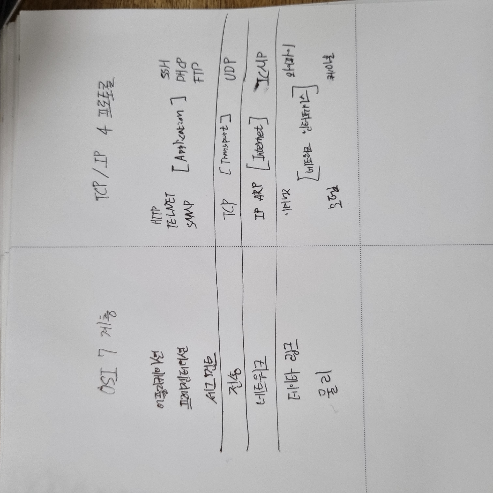

### 2022-01-09


스프링 프레임워크

핵심 기술 : 스프링 DI 컨테이너, AOP, 이벤트, 기타
웹 기술: 스프링 MVC, 스프링 WebFlux
데이터 접근 기술 : 트랜잭션, JDBC, ORM, XML
기술 통합 : 캐시, 이메일, 원격접근, 스케줄링
테스트 : 스프링 기반 테스트 지원
언어 : 코틀린, 그루비
최근에는 스프링 부트를 통해서 스프링 프레임워크의 기술들을 편리하게 사용

스프링 부트

스프링을 편리하게 사용할 수 있도록 지원, 최근에는 기본으로 사용
단독으로 실행할 수 있는 스프리 애플리케이션을 쉽게 생성
Tomcat 같은 웹서버를 내장해서 별도의 웹 서버를 설치하지 않아도 됨
손쉬운 빌드 구성을 위한 starter 종속성 제공
스프링 3rd parth(외부) 라이브러리 자동 구성
메트릭, 상태 확인, 외부 구성 같은 프로덕션 준비 기능 제공
관례에 의한 간결한 설정

스프링의 진짜 핵심

스프링은 자바 언어 기반의 프레임워크
자바 언어의 가장 크 특징 - 객체 지향 언어(Object Oriented Program)
스프링은 객체 지향 언어가 가진 강력한 특ㅈㅇ을 살려내는 프레임워크 
스프링은 좋은 객체 지향 어플리케이션을 개발할 수 있게 도와주는 프레임워크 

# 따로 채워넣은 후 URL 링크 달기
객체 지향 특징 (OOP) 

추상화
캡슐화
상속
다형성

객체 지향 프로그래밍

객체지향 프로그래밍은 컴퓨터 프로그램을 명령어의 목록으로 보는 시각에서 벗어나 여러개의 독립된 단위, 즉
"객체"들의 모임으로 파악하고자 하는 것이다. 각각의 객체는 메세지를 주고받고, 데이터를 처리할 수 있다. (협력)

객체 지향 프로그래밍은 프로그램을 유연하고 변경이 용이하게 만들기 때문에 대규모 소프트웨어 개발에 많이 사용된다.

다형성의 실세계 비유

실세계와 객체 지향을 1:1로 매칭x
그래도 실세계의 이해하기에는 좋음
역할과 구현으로 세상을 구분

예제 1.운전자 - 자동차

운전자 역할 <-> 자동차 역할 <- 자동차 구현(k3, 아반떼, 테슬라 모델3)

예제 2.공연 무대

남자배역(장동건, 강동원) -> 로미오 역할 <-> 줄리엣 역할 <-  여자배역(김태희, 송혜교)

역할과 구현을 분리

역할과 구현으로 구분하면 세상이 단순해지고, 유연해지며 변경도 편리해진다
장점
클라이언트는 대상의 역할(인터페이스)만 알면 된다.
클라이언트는 구현 대상의 내부 구조를 몰라도 된다.
클라이언트는 구현 대상의 내부 구조가 변경되어도 영향을 받지 않는다.
클라이언트는 구현 대상 자체를 변경해도 영향을 받지 않는다.

역할과 구현을 분리
자바 언어가

자바 언어의 다형성을 활용
	역할 = 인터페이스
	구현 = 인터페이스를 구현한 클래스, 구현 객체
객체를 설계할 때 역할과 구현을 명확히 분리
객체 설계시 역할(인터페이스)을 먼저 부여하고, 그 역할을 수행하는 구현 객체 만들기	

다형성의 본질

인터페이스를 구현한 객체 인스턴스를 실행 시점에 유연하게 변경할 수 있다.
다형성의 본질을 이해하려면 협력이라는 객체사이의 관계에서 시작해야함
클라이언트를 변경하지 않고, 서버의 구현 기능을 유연하게 변경할 수 있다.

#나의 생각 (모르겠다 레포) 영한 센세 알려줘요...
구현을 할 때 생각해야할 것!

클라이언트 라는 공통의 사용자들이 있어
그리고 여기에는 각각의 기능들이 있어.
이 기능들은 쉽게 변하지 않아. 물론 정책에 따라서 변경이 될 수도 있어.
그리고 이 기능을 수행하는 로직은 수많은 가능성을 가지고 있어
그래서 여러 서비스 로직이 합쳐져야해
그래서 이 서비스 로직들은 뭉탱이로 있고 여러 형태로 가지고 있을 수가 있어

컨트롤러 -> 서비스 -> 레포

컨트롤러가 서비스에게 주는 값은 거의 변하지 않아. 

서비스는 사용자의 편의를 위해서 여러 기능이 추가될 수 있어

레포는 이 서비스에서 디비를 접근할 때 사용을 해


### 2021-12-22

리프레시 토큰은 일단 Authorization이 Basic auth가 되어 있어야 하며, grant_type이 refresh_token이여야 하며, refresh_token이 있어야 한다.

이것까지 모두 성공 한줄 알았으나...

어제까지 작업한 내용 중 

```
@EnableResourceServer
@Configuration
public class ResourceServerConfig extends ResourceServerConfigurerAdapter {

	private static final String[] AUTH_WHITELIST = {
            // -- Swagger UI v2
            "/v2/api-docs",
            "/swagger-resources",
            "/swagger-resources/**",
            "/configuration/ui",
            "/configuration/security",
            "/swagger-ui.html",
            "/webjars/**",
            // -- Swagger UI v3 (OpenAPI)
            "/v3/api-docs/**",
            "/swagger-ui/**",
            "/swagger-ui/index.html",
            // other public endpoints of your API may be appended to this array
            "/v1/callback",
            "/v1/login",
    };

	@Override
	public void configure(HttpSecurity http) throws Exception {
		http.authorizeRequests()
//				.antMatchers("/v1/**")
//////				.access("#oauth2.hasScope('write||download')")
//				.hasRole("USER") // 사용자의 authorites 확인
				.antMatchers(AUTH_WHITELIST)
				.permitAll()
				.anyRequest()
				.authenticated();
	}


}
```


해당 클래스에 모든 내용을 주석을 처리해서 했을때 JWT가 제대로 작동하지 않았다.


> @EnableResourceServer

이것에 대해서 좀 제대로 알아볼 필요가 있다.

이것에 대한 내용은 내일 추가로 기술하도록 하겠다.


토드 꿀팁에 대해서 좀 알아야 할 필요가 있다.


> 토드

TNS 설정 및 기본 실행방법

https://chinpa.tistory.com/46

단축키

https://ggomc.tistory.com/36

https://blog.naver.com/PostView.nhn?blogId=jujiwan83&logNo=221549404678&parentCategoryNo=&categoryNo=25&viewDate=&isShowPopularPosts=true&from=search

꿀팁(그림첨부)

https://webgle.tistory.com/61


> 오라클

함수 관련

https://preamtree.tistory.com/40

Exists 사용이유 (성능상 더 좋을때)

https://gent.tistory.com/278?category=360526

내일 볼 오라클 꿀팁

https://gent.tistory.com/category/%EB%8D%B0%EC%9D%B4%ED%84%B0%EB%B2%A0%EC%9D%B4%EC%8A%A4/%EC%98%A4%EB%9D%BC%ED%81%B4?page=11


### 2021-12-21

자주쓴는 쿼리

```sql
show columns from 테이블명
```

자바 Local variable '변수명' defined in an enclosing scope must be final or effectively final 에러 해결방법

https://wakestand.tistory.com/432


오늘은 그동안 구상했던 시큐리티를 완성 했다. 기본적인 내용만 적용을 했으며, 비지니스 로직에 따라 추가 및 수정을 하면된다.

나의 구성도는 시큐리티 페이지에서 확인을 할 수 있다. 감사합니다.


The server time zone value 오류시

https://devuna.tistory.com/47


오늘 알게된 엄청난 방식

Basic Auth 만드는 방법은

username + : + password를 base64로 인코딩 한 것이다.


스웨거 Authorization 하는방법

https://lemontia.tistory.com/1027


오늘은 스웨거 까지 적용을 완료 하였고, 추후에 refresh_token을 이용해서 토큰 연장하는거 까지 구현하도록 하겠습니다.


### 2021-12-16

erd 그리는 방법

https://mjn5027.tistory.com/43


### 2021-12-14

@Controller와 @RestController 차이

https://mangkyu.tistory.com/49

ftp, ftps, sftp(ssh) 개념 정리

https://nhj12311.tistory.com/76

네트워크 스위치 종류(L2, L3, L4, L7 개념) 정리

https://nhj12311.tistory.com/75

리눅스 명령어

https://dora-guide.com/linux-commands/

주요 리눅스 명령어

https://honeyteacs.tistory.com/category/Server/%EB%A6%AC%EB%88%85%EC%8A%A4

리눅스 연습 사이트

https://bellard.org/jslinux/


### 2021-12-09

아파치와 톰캣의 차이

정리 필수!!!!

https://limmmee.tistory.com/4

아파치는 80포트로 시작하며 웹 서버입니다. 주로 html, css, js를 다룰 수 있습니다.

톰캣은 8080포트로 시작하며, WAS (Web Application Server) 입니다. 서블릿, DB, 데이터 조작을 할 수 있습니다.


서블릿이란?

정리 필수!!!!

https://mangkyu.tistory.com/14


### 2021-12-08

나만의 권한 설정 hasPermission 설정하기

https://hodolman.com/19

오버라이드 단축키

alt + shift + s -> override/implements


hasPermission DB 연동 안될때 해결 방법 그리고 몇가지 hasPermission 설정 방법도 나와있음

https://stackoverflow.com/questions/21866905/autowired-in-spring-permissionevaluator


### 2021-12-07

스프링 시큐리티 @PreAuthorize 적용 시키는 법이랑

https://stackoverflow.com/questions/32442408/preauthorize-not-working-on-controller/32443631

Principle

```java
    @PreAuthorize("hasAuthority('ROLE_USER')")
    @GetMapping("/users")
    public String findAllUser(Principal user) {
        return user.getName(); // jwt 인증된 user 정보 가져올 수 있음
    }
```

스프링 시큐리이 -3 요청 가로채기

https://m.blog.naver.com/kimnx9006/220638156019


### 2021-12-06

자바 스트림

https://futurecreator.github.io/2018/08/26/java-8-streams/

### 2021-12-03

어제 jwt를 공부하는것에 대해 성공적으로 구축을 했습니다.

다만 현재 내가 공부한 내용으로는 다 알 수 있지는 않았다.

내일은 front도 한번 구축 하면서 사용자의 권한 설정과 메뉴들의 권한 설정에 대해 공부 하도록 하겠다.

진짜 고민이 많이 된다.


1. 헤더 메뉴

2. 사이드 메뉴
3. 유저별 권한

이 정도가 내일 구현해볼 내용이다. 진짜 어제 찾은 곳은 나에겐 엄청난 희망과 같은 곳이였다.


draw.io 툴 다운로드

https://github.com/jgraph/drawio-desktop/releases


### 2021-12-02

mybatis 모델링

https://limjunho.github.io/2021/07/30/JAVA-DAO-DTO-VO.html

진짜 중요한 mybatis - jwt 내일 이거 마스터 해야 집간다.

https://gaemi606.tistory.com/entry/Spring-Boot-Spring-Security-OAuth2?category=745027


### 2021-11-25

인터셉터 NPE 해결

https://velog.io/@tlatldms/Spring-%EC%9D%98%EC%A1%B4%EC%84%B1-%EC%A3%BC%EC%9E%85-%EB%AC%B8%EC%A0%9C-Autowired-%ED%95%9C-class%EA%B0%80-null%EB%A1%9C-%EB%82%98%EC%98%AC-%EB%95%8C

```
1. 정산 시스템 Export 서비스 개발 및 이슈 해결
-개발 기간 : 2021-06-23
-내용 :
	1-1. 매출정산 대용량 데이터 CSV 다운로드 개발
2. 슬랙 메세지 전송 api 개발
-개발 기간 : 2021-07-05 ~ 2021-07-10
-내용 : 
	2-1. 결제/정산 서비스 오류 에러 로그 슬랙으로 알림 기능 개발
	2-2. Api 파일 다운로드 DM 알림 기능 개발
	2-3. 사용자 비밀번호 및 아이디 변경 내용 DM 알림 기능 개발
3. 정산 시스템 1차 DB 스키마 관리
-관리 기간 : 2021-07-01 ~ 2021-08-30
-내용 :
	3-1. 결제/정산 관련 테이블 변경된 내용 수정
	3-2. DML 작성 및 관리
4. 정산 시스템 1차 QA
-QA 기간 : 2021-08-05 ~ 2021-10-07
-내용 :
	4-1. 엑트베이스에서 개발한 1차 BO 잔여이슈 확인 및 전달
5. 정산 시스템 가상계좌 Front 개발
-개발 기간 : 2021-10-04 ~ 2021-10-22
-내용 :
	5-1. 가상계좌 입금내역조회 Front 개발
	5-2. 세틀뱅크 정산내역조회 Front 개발
	5-3. 펌뱅킹 입금내역조회 Front 개발
	5-4. 가상계좌 거래대사 및 불일치 상세내역 Front 개발
6. 정산 시스템 매출정산 Front 및 Api 개발
-개발 기간 : 2021-10-22 ~ 2021-11-12
-내용 :
	6-1. 대량주문 매출내역조회 및 제품 상세내역 Front 및 Api 개발
	6-2. 주문서복원 매출내역조회 Front 및 Api 개발
	6-3. 재주문 매출내역조회 Front 및 Api 개발
7. 정산 시스템 1차 개발 기능 개선 및 이슈 처리 수행
-개발 기간 : 2021-11-01 ~ 2021-11-30
-내용 :
	7-1. 1차 개발 잔여이슈 수정
	7-2. 1차 개발내용 기능 추가
8. 보안성 검토사항 이력 DB 설게 및 Api 개발
-개발 기간 : 2021-11-23 ~ 2021-11-30
-내용 :
	8-1. 사용자 API 호출 내역 데이터 저장 개발
```


### 2021-11-24

파일 만들기 ㅎㅎ

https://www.delftstack.com/ko/howto/javascript/javascript-download/

http://pakss328.blogspot.com/2017/08/csv.html

두개 사이트 짬뽕 해서 이런 값일때

```
access-control-allow-credentials: true
access-control-allow-headers: Origin, X-Requested-With, Content-Type, Accept, Key, Authorization, unique_id
access-control-allow-methods: GET,POST,PUT,DELETE
access-control-allow-origin: http://localhost:3000
access-control-max-age: 3600
cache-control: no-cache, no-store, max-age=0, must-revalidate
content-disposition: attachment;filename*=euc-kr''파일이름.csv
content-encoding: gzip
content-type: application/octet-stream;charset=euc-kr
date: Wed, 24 Nov 2021 10:52:41 GMT
expires: 0
pragma: no-cache
vary: Accept-Encoding
vary: Origin
vary: Access-Control-Request-Method
vary: Access-Control-Request-Headers
x-content-type-options: nosniff
x-frame-options: DENY
x-xss-protection: 1; mode=block
```

프론트 화면에서

```
onClick={async () => {
                    const file = await restApi.get().then((response) => {
                      const url = window.URL
                        .createObjectURL(new Blob(["\ufeff"+response.data], {type: 'text/csv;charset=UTF-8'}))
                      const link = document.createElement('a');
                      link.href = url;
                      link.setAttribute('download', v?.fileName);
                      document.body.appendChild(link);
                      link.click();
                      document.body.removeChild(link);
                    });
                    console.log('file', file)
                  }}
```

이와같이 잘 되었다.

핵심은 

(new Blob([**"\ufeff"**+response.data], {**type: 'text/csv;charset=UTF-8'**}))

이 부분이다.

JWT : In Memory 형식

https://hasura.io/blog/best-practices-of-using-jwt-with-graphql/#login

내일 볼건데 미리 작성함

### 2021-11-23


Spring Boot [Interceptor] : https://congsong.tistory.com/24


스프링 부트 인터셉터를 하면서 알게된건 

React에서 url 정보를 볼려고 하면 볼 수 없다는 것이다.

ex) www.test.com/test
라는 url을 치고 들어가면 CSR에서는 www.test.com/ 이라고 밖에 나타나지 않고

api에서 데이터 호출한 endpoint만 나타난다는 것이다.

이걸 어떻게 해결해야할지 많은 고민을 해야할거 같다.


접근 메뉴를 DB에 저장하는 방법으로 React에서 메뉴가 변경될때마다 

React Hook인 useEffect를 사용해서 메뉴의 값을 찾아와 데이터를 db에 axios를 이용해서

값을 저장할 생각이다. 그러나 이 처리 방식이 서버에 얼마나 부담이 될지는 영향도 분석을 해야한다.


인터셉터를 이용해서 endpoint 값을 저장하고 해당 내용을 맵핑 테이블이나 enum 클래스를 만들어서

값을 변환 시키는 작업을 해볼까한단.


아 그리고 어제 스웨거 문제는 이와같이 해결했다


```
@Configuration
@EnableWebSecurity
@EnableGlobalMethodSecurity(prePostEnabled = true, securedEnabled = true)
public class SecurityConfiguration extends WebSecurityConfigurerAdapter {

    private static final String[] AUTH_WHITELIST = {
            // -- Swagger UI v2
            "/v2/api-docs",
            "/swagger-resources",
            "/swagger-resources/**",
            "/configuration/ui",
            "/configuration/security",
            "/swagger-ui.html",
            "/webjars/**",
            // -- Swagger UI v3 (OpenAPI)
            "/v3/api-docs/**",
            "/swagger-ui/**"
            // other public endpoints of your API may be appended to this array
    };


    @Override
    protected void configure(HttpSecurity http) throws Exception {
        http.
                // ... here goes your custom security configuration
                authorizeRequests().
                antMatchers(AUTH_WHITELIST).permitAll().  // whitelist Swagger UI resources
                // ... here goes your custom security configuration
                antMatchers("/**").authenticated();  // require authentication for any endpoint that's not whitelisted
    }

}
```


### 2021-11-22

다시 시작된 jwt 학습 오늘은 과연 어디까지 할 수 있을지...

2021-11-10의 내용을 참고하여 오늘 다시 개발을 하도록 하겠다.

jwt : https://velog.io/@tlatldms/Spring-boot-Spring-security-Jwt-1-fvk5hlol8u

jwt 소스2 : https://www.javainuse.com/spring/boot-jwt-mysql


오늘은 user 테이블을 만들어서 계정을 만들고 만든 계정으로 jwt 토큰을 생성하는걸 만들었다!


그러나 아직도 스웨거는 안된다...

이걸 어떻게 해결할 수 있을까...

내일 다시 시도해야겠다


### 2021-11-16

aws 템플릿을 이용해 인스턴트 생성하는거 하기.

인스터트에 putty로 접속해 httpq 띄우기




### 2021-11-15

JWT를 해야하지만 오늘은 잠시 AWS 구축 공부를 해보도록 하겠습니다.

#### Cloud Infra & Network 기술에 대한 정보를 공유

https://www.notion.so/gasidaseo/CloudNet-Blog-c9dfa44a27ff431dafdd2edacc8a1863

#### 따라하며 배우는 AWS 네트워크 입문

https://www.notion.so/ongja/AWS-1af579548fd84c268f8f3ee3f26b2ed4

test

### 2021-11-12

하루종일 gitlab 업그레이드 검색함

gitlab은 업그레이드를 하면 데이터 마이그레이션을 꼭 해야함

### 2021-11-11

https://ux.stories.pe.kr/190
https://wikidocs.net/83152

### 2021-11-10

정리 필수!!!!

cors 맛보기 : https://oddpoet.net/blog/2017/04/27/cors-with-spring-security/

cors 자세한 설명 : https://developer.mozilla.org/ko/docs/Web/HTTP/CORS

jwt : https://velog.io/@tlatldms/Spring-boot-Spring-security-Jwt-1-fvk5hlol8u

spring annotation : https://galid1.tistory.com/494


jwt 소스 :  https://www.javainuse.com/spring/boot-jwt

jwt 소스2 : https://www.javainuse.com/spring/boot-jwt-mysql


오늘까지는 jwt를 통해 토큰을 만드는 것 까지는 만들었다.

하지만 jwt때문에 swagger가 401에러가 발생 했다. 

이 에러를 잡기 위해서는 swagger는 401이 안나게 처리를 하는 로직을 만들어야 한다.

그건 어떻게 해야할까...?


일단은 계속 작업할거고 이번주는 프로젝트를 구성하고 연습하고 문제 해결을 해나갈 것이다.

그리고 인증 토큰이 개발이 되면 해당 url에 정리된 내용과 나의 소스를 비교하면서 자세하게 정리하도록

하겠다. 오늘은 토큰까지만 생성!


### 2021-11-09

오늘 학습한 내용에 대해 정리

spring boot 초기 환경설정

내가 진행한 내용은 spring boot , gradle, jpa, mariaDB를 사용해서 프로젝트를 생성 하였다.

자세한 내용은 내일 추가적으로 기술하겠습니다.


프로젝트를 구성하기 위해 참고한 문서

김영한님의 실전JPA 자료

스웨거 설정 : [https://milenote.tistory.com/67](https://milenote.tistory.com/67){:target='_blank'}

오픈 api 사용 방법 : https://tjdans.tistory.com/6?category=990955

오픈 api 사용 방법2 : https://jeong-pro.tistory.com/143

공공 데이터 : https://www.data.go.kr/iim/api/selectAPIAcountView.do

gitHub 토큰(로그인 하라고 뜰때) :  https://joytk.tistory.com/58

이클립스 코드 정렬 커스텀 : https://gofnrk.tistory.com/68

### 2021-11-04

https://velog.io/@tmdgh0221/Spring-Security-%EC%99%80-OAuth-2.0-%EC%99%80-JWT-%EC%9D%98-%EC%BD%9C%EB%9D%BC%EB%B3%B4
