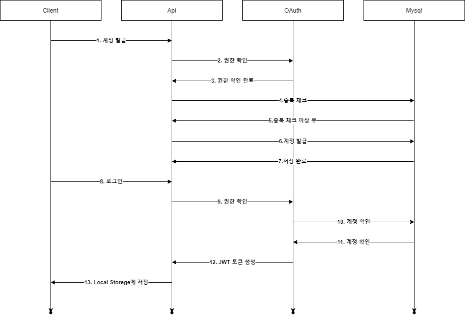

스프링 시큐리티 개인 프로젝트를 하면서 익힌 내용에 대해서 정리 하도록 하겠습니다.

내가 참고한 사이트

https://gaemi606.tistory.com/entry/Spring-Boot-Spring-Security-OAuth2?category=745027


## 1. Arcitecture





내가 생각 하는 시큐리티에 대해서 정리를 해보았다.


1. **계정 발급**
   1. admin 권한이 있는 사용자가 계정을 생성한다.
2. **권한 확인**
   1. admin이 아니면 계정 생성을 못하게 한다.
   2. admin이면 계정을 생성할 수 있게 한다.
3. **권한 확인 완료**
   1. admin이면 계정을 생성할 수 있게 한다.
   2. api에서 mysql 접근을 가능하게 한다.
4. **중복 체크**
   1. 계정이 중복 체크를 해서 생성 가능 여부를 판단한다.
   2. 중복이면 계정 생성을 못하게 한다.
5. **중복 체크 이상 무**
   1. mysql에 계정을 생성한다.
6. **계정 발급**
   1. mysql에 계정을 생성한다.
7. **저장 완료**
   1. 사용자에게 생성완료 알림을 준다.
8. **로그인**
   1. 사용자는 로그인을 한다.
   2. oauth에서 권한이 무엇인지 확인을 한다.
9. **권한 확인**
   1. 확인을 완료 했으면 계정을 확인하다.
10. **계정 확인**
    1. mysql에 계정이 있는지 확인을 한다.
11. **계정 확인완료**
    1. oauth에서 권한에 따라 JWT를 생성을 한다.
    2. grant_type에 대해 아직 정확하게 파악은 안되지만, AT와 RT 설정을 추가할 수 있다.
12. **JWT 토큰 생성**
    1. JWT 토큰을 생성 후 사용자가 사용을 하며, api 접근할때마다 JWT 판별을 할 수 있게 한다.
13. **Local Storege에 저장**
    1. 새로고침하면 사라지지 않게 Loacl Storege에 저장을해서 api 호출할때마다 판별할 수 있게 한다.


## 2. 소스 파악


### 2차 DB 구조

#### OAuth 인증을 위한 Table

```sql
CREATE TABLE `oauth_client_details` (
  `client_id` varchar(256) NOT NULL,
  `resource_ids` varchar(256) DEFAULT NULL,
  `client_secret` varchar(256) DEFAULT NULL,
  `scope` varchar(256) DEFAULT NULL,
  `authorized_grant_types` varchar(256) DEFAULT NULL,
  `web_server_redirect_uri` varchar(256) DEFAULT NULL,
  `authorities` varchar(256) DEFAULT NULL,
  `access_token_validity` int DEFAULT NULL,
  `refresh_token_validity` int DEFAULT NULL,
  `additional_information` varchar(4096) DEFAULT NULL,
  `autoapprove` varchar(256) DEFAULT NULL,
  PRIMARY KEY (`client_id`)
) ENGINE=InnoDB DEFAULT CHARSET=utf8mb3
```


```
INSERT INTO test.oauth_client_details (client_id, resource_ids, client_secret, `scope`, authorized_grant_types, web_server_redirect_uri, authorities, access_token_validity, refresh_token_validity, additional_information, autoapprove) VALUES('clientId', NULL, '{bcrypt}$2a$10$AvUPSZRNoWnWsKR86Z5Tj.0HSrwP.B8PbpJIseo8yOANZJXKT8MlO', 'read,write', 'authorization_code,password,refresh_token', 'http://localhost:8080/oauth2/callback', 'ROLE_USER', 3000, 6000, NULL, 'true');
INSERT INTO test.oauth_client_details (client_id, resource_ids, client_secret, `scope`, authorized_grant_types, web_server_redirect_uri, authorities, access_token_validity, refresh_token_validity, additional_information, autoapprove) VALUES('clientId2', NULL, '{bcrypt}$2a$10$AvUPSZRNoWnWsKR86Z5Tj.0HSrwP.B8PbpJIseo8yOANZJXKT8MlO', 'write,download', 'authorization_code,password,client_credentials,refresh_token', 'http://localhost:8080/oauth2/callback', 'ROLE_ADMIN', 100, 300, NULL, 'true');

```


#### User Table

```sql
CREATE TABLE `user` (
  `username` varchar(50) CHARACTER SET utf8mb4 COLLATE utf8mb4_0900_ai_ci NOT NULL,
  `password` varchar(255) CHARACTER SET utf8mb4 COLLATE utf8mb4_0900_ai_ci NOT NULL,
  `role_group_id` bigint DEFAULT NULL,
  PRIMARY KEY (`username`) USING BTREE
) ENGINE=InnoDB DEFAULT CHARSET=utf8mb4 COLLATE=utf8mb4_0900_ai_ci
```


```
INSERT INTO test.`user` (username, password, role_group_id) VALUES('victor', '{bcrypt}$2a$10$fZm3gvYpnovFwhKGislap.tsuIggPSod9swM0lLO3eQtguHkGi2gy', 1);
INSERT INTO test.`user` (username, password, role_group_id) VALUES('victor2', '{bcrypt}$2a$10$fZm3gvYpnovFwhKGislap.tsuIggPSod9swM0lLO3eQtguHkGi2gy', 1);

```


#### 권한 그룹 Table

```sql
CREATE TABLE `role_group` (
  `id` bigint unsigned NOT NULL AUTO_INCREMENT,
  `name` varchar(255) NOT NULL,
  PRIMARY KEY (`id`)
) ENGINE=InnoDB DEFAULT CHARSET=utf8mb4 COLLATE=utf8mb4_0900_ai_ci
```


#### 권한 상세 Table

```sql
CREATE TABLE `role_group_details` (
  `id` bigint unsigned NOT NULL AUTO_INCREMENT,
  `role_group_id` bigint unsigned NOT NULL,
  `menu_id` bigint unsigned NOT NULL,
  `scope` varchar(50) DEFAULT NULL,
  PRIMARY KEY (`id`)
) ENGINE=InnoDB DEFAULT CHARSET=utf8mb4 COLLATE=utf8mb4_0900_ai_ci
```


#### 메뉴 Table

```sql
CREATE TABLE `menu` (
  `id` bigint unsigned NOT NULL AUTO_INCREMENT,
  `menu_id` bigint unsigned NOT NULL,
  `parent_menu_id` bigint unsigned DEFAULT NULL,
  `menu_path` varchar(50) DEFAULT NULL,
  `menu_name` varchar(50) DEFAULT NULL,
  `menu_order` int NOT NULL DEFAULT '0',
  PRIMARY KEY (`id`)
) ENGINE=InnoDB DEFAULT CHARSET=utf8mb4 COLLATE=utf8mb4_0900_ai_ci
```


## 사용툴

jdk 1.8

sts4

롬복

소스트리

디비버

하이디 sql

포스트맨

drawio

타이포라


## 이전꺼


### 1차 DB 구조

나는 해당 프로젝트 동안 mybatis를 통해 db와 연결을 했으며, mysql을 사용해서 DB를 구축했다.

#### OAuth 인증을 위한 Table

```sql
CREATE TABLE `oauth_client_details` (
	`client_id` VARCHAR(256) NOT NULL COLLATE 'utf8_general_ci',
	`resource_ids` VARCHAR(256) NULL DEFAULT NULL COLLATE 'utf8_general_ci',
	`client_secret` VARCHAR(256) NULL DEFAULT NULL COLLATE 'utf8_general_ci',
	`scope` VARCHAR(256) NULL DEFAULT NULL COLLATE 'utf8_general_ci',
	`authorized_grant_types` VARCHAR(256) NULL DEFAULT NULL COLLATE 'utf8_general_ci',
	`web_server_redirect_uri` VARCHAR(256) NULL DEFAULT NULL COLLATE 'utf8_general_ci',
	`authorities` VARCHAR(256) NULL DEFAULT NULL COLLATE 'utf8_general_ci',
	`access_token_validity` INT(10,0) NULL DEFAULT NULL,
	`refresh_token_validity` INT(10,0) NULL DEFAULT NULL,
	`additional_information` VARCHAR(4096) NULL DEFAULT NULL COLLATE 'utf8_general_ci',
	`autoapprove` VARCHAR(256) NULL DEFAULT NULL COLLATE 'utf8_general_ci',
	PRIMARY KEY (`client_id`) USING BTREE
)
COLLATE='utf8_general_ci'
ENGINE=InnoDB
;
```

해당 테이블은 매우매우 중요하다


#### User 테이블

```sql
CREATE TABLE `user` (
	`id` BIGINT(20,0) NOT NULL AUTO_INCREMENT,
	`name` VARCHAR(50) NULL DEFAULT NULL COLLATE 'utf8mb4_0900_ai_ci',
	`password` VARCHAR(255) NULL DEFAULT NULL COLLATE 'utf8mb4_0900_ai_ci',
	`authorites` VARCHAR(50) NULL DEFAULT NULL COLLATE 'utf8mb4_0900_ai_ci',
	PRIMARY KEY (`id`) USING BTREE
)
COLLATE='utf8mb4_0900_ai_ci'
ENGINE=InnoDB
AUTO_INCREMENT=2
;
```

해당 테이블은 간단한 user 정보를 사용할 수 있도록 구성을 하였ㄷ


## 브레인스토밍


로그인을 할려면 사용자 정보가 있어야 해

그래서 회원가입을 해

회원가입이 됐어

근데 들어가 보니 메뉴가 아무것도 안보여

왜냐 메뉴가 없거든

그래서 메뉴를 만들어

근데 이걸 아무한테나 다 보여줘야 하나?

아니 권한이 있는 사용자들 한테만 보여줘야 해

그러면 메뉴마다 권한을 만들어 줘야해

그럼 권한을 만들어줘

근데 권한을 관리를 해야겠지

새로운 권한을 추가할 수도 있어야 하고

근데 새로운 권한이라는게 메뉴에 대한 권한이겠지


그럼 메뉴를 관리,등록하는 화면도 만들어야 하고

유저를 관리.등록하는 화면도 만들어야 하고

권한을 관리,등록하는 화면도 만들어야 하고


만드는 순서

유저 -> 메뉴 -> 권한 -> 권한 상세


관계

유저 -> 권한 -> 권한 상세 = 메뉴


테이블

유저

- 아이디
- 비밀번호
- 권한 그룹


